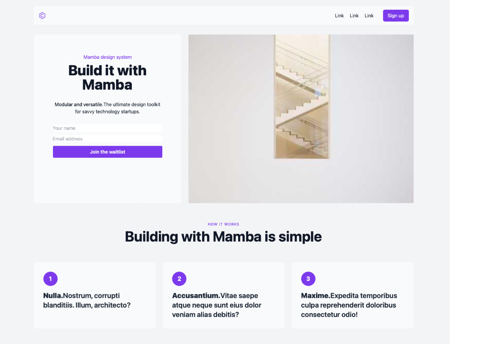

# TailwindCSS LandingPage

In this project, A LandingPage designed for a writer using HTML and TailwindCSS. 

## Technologies Used

- **HTML**: It was used as the structural document markup language.
- **Tailwind**: It was used for responsive design and to streamline the styling process.

