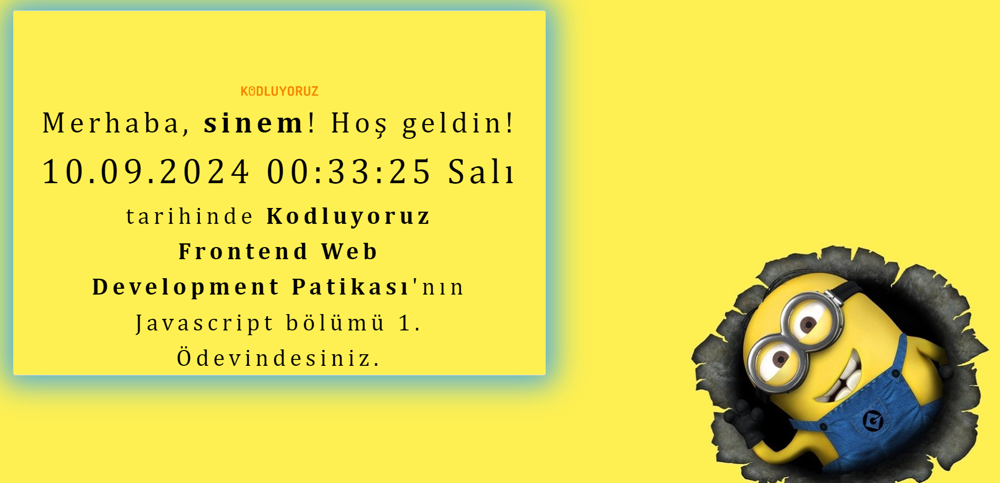

# Javascript Saat ve Karşılama

In this project, The page features a dynamic clock and greeting message using JavaScript. The project is built with HTML, CSS, Bootstrap, and JavaScript.

## Technologies Used

- **HTML**: It was used as the structural document markup language.
- **CSS**: Used for styling the page.
- **Bootstrap**: Utilized as a CSS framework, making the design responsive and easier to implement.
- **JavaScript**: Implemented to display a dynamic clock and greeting message.

