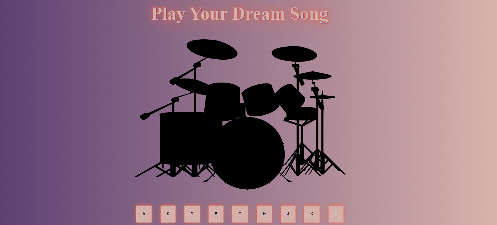

# Javascript Drum Kit 

In this project, I created an interactive Drum Kit website using basic HTML, CSS, and JavaScript

## Technologies Used

- **HTML**: It was used as the structural document markup language.
- **CSS**: Used for styling the page.
- **JavaScript**: It was used to play sound files and add animations when the drum kit buttons are clicked.

