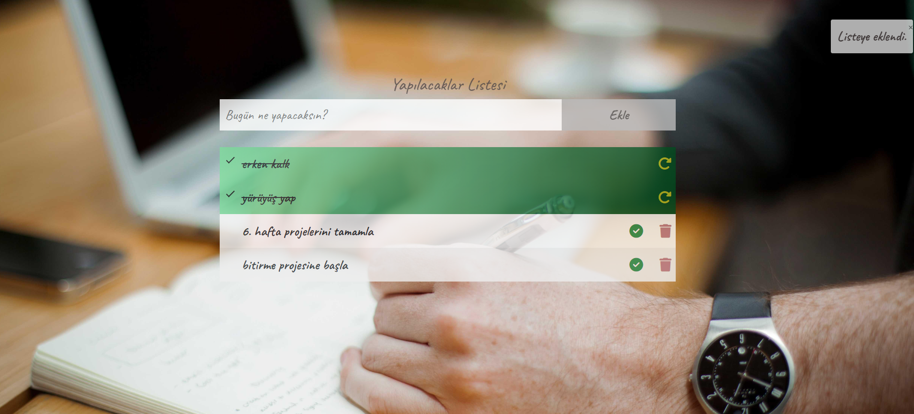

# To Do List Project

In this project, a To Do List application was developed where users can add tasks to the list, mark tasks as completed when done, and remove unnecessary tasks from the list. The project is styled using Bootstrap, and tasks are stored in the browser, ensuring they remain even after the page is refreshed.

## Features

- Add tasks to the list: Users can add a task by entering it into the input field.
- Mark tasks as completed: Once tasks are done, users can mark them as completed.
- Remove tasks: Unnecessary tasks can be removed from the list.
- Prevention of adding empty tasks: If a user tries to add an empty or whitespace-only task, it is prevented, and the user is notified.
- Toast notifications: Using Bootstrap, notifications appear in the top-right corner of the screen when tasks are successfully - added or when errors occur.
- LocalStorage integration: Tasks are saved in localStorage, ensuring they persist even when the page is refreshed.

## Technologies Used
- **HTML**: Used to structure the page.
- **CSS**: Used for styling the page.
- **JavaScript**: JavaScript was used to handle all the interactive functions.
- **Bootstrap**: The page was styled using the Bootstrap library.
- **LocalStorage**: Used to store user data persistently in the browser.

