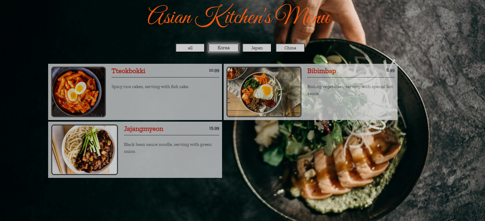

# Asian Kitchen's Menu

The Asian Kitchen's Menu project is a dynamic web application that displays a variety of Asian dishes. Users can view the menu items and filter them by category, allowing for an easy and interactive way to explore delicious options from different Asian cuisines, including Korean, Japanese, and Chinese dishes.

## Features

- Dynamic Menu Display: The menu items are rendered dynamically based on an array of dish objects.
- Category Filtering: Users can filter dishes by categories such as "Korea", "Japan", "China", and "all".
- Responsive Design: The layout is designed to be responsive, ensuring a great user experience on various devices.

## Technologies Used
- **HTML**: Used to structure the page.
- **CSS**: Used for styling the page.
- **JavaScript**: For dynamic functionality, including rendering the menu and handling category filtering.

